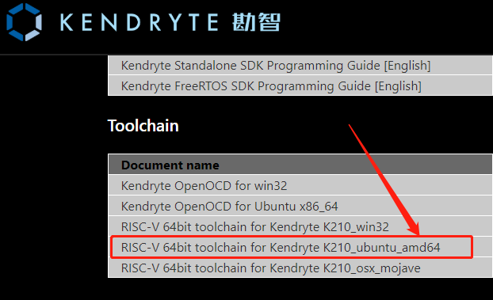
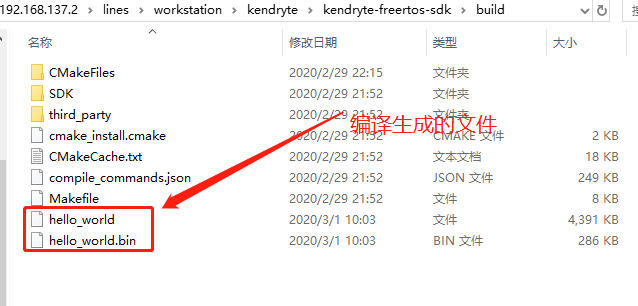

# 基于Ubuntu-1604搭建K210编译环境

## 下载编译工具链
[下载地址 https://kendryte.com/downloads/](https://kendryte.com/downloads/)  



## 安装工具链

```shell
## 解压工具链到/opt目录
$ sudo mkdir /opt/kendryte
$ tar xvf kendryte-toolchain-ubuntu-amd64-8.2.0-20190213.tar.gz -C /opt/kendryte
## 注：不需要把工具链设置到环境，可以通过编写shell脚本来export即可

## 升级cmake到3.9.2
## 查看cmake的版本
$ cmake --version
## 如果cmake的版本大于3.7.1，不需要升级

## 删除原有的cmake
$ sudo apt-get remove cmake
$ wget https://cmake.org/files/v3.9/cmake-3.9.2.tar.gz
## 如果网络不好，可以直接用浏览器下载
$ tar xvf cmake-3.9.2.tar.gz
$ cd cmake-3.9.2/
$ ./configure
$ make
$ sudo make install
## 再次确认是否安装成功
$ cmake --version
```

## 下载编译 kendryte-freertos-sdk
```shell
## 克隆代码
$ git clone https://github.com/kendryte/kendryte-freertos-sdk.git
cd kendryte-freertos-sdk
mkdir build
cd build 
cmake .. -DPROJ=hello_world -DTOOLCHAIN=/opt/kendryte/kendryte-toolchain/bin
make
```
**编译成功后输出文件：**


## 问题和解决方法
---
### 找不到libisl.so.19库文件
   * 下载amd64版本的libisl，下载地址 https://packages.ubuntu.com/zh-cn/disco/libisl19
   * 安装libisl.so.19, 执行命令:  sudo dpkg -i libisl19_0.20-2_amd64.deb
 
### 找不到libmpfr.so.6库文件
```shell
## 下载mpfr源码，下载地址：https://www.mpfr.org/mpfr-current/#download
## 解压安装
$ tar xvf mpfr-4.0.2.tar.xz
$ cd mpfr-4.0.2/
$ ./configure
$ make
$ sudo make install
## 如果还是找不到，可以手动复制
$ sudo cp /usr/local/lib/libmpfr.so* /usr/lib/

```