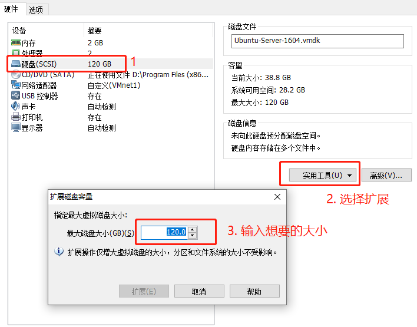

# Ubuntu Server 扩容

### 1 设置硬盘大小




### 2. 进入系统

```shell
## 查看当前磁盘
ubuntu:~$ df -h
Filesystem      Size  Used Avail Use% Mounted on
udev            976M     0  976M   0% /dev
tmpfs           200M  6.2M  193M   4% /run
/dev/sda1        46G   38G  5.7G  87% /
tmpfs           996M     0  996M   0% /dev/shm
tmpfs           5.0M     0  5.0M   0% /run/lock
tmpfs           996M     0  996M   0% /sys/fs/cgroup
tmpfs           200M     0  200M   0% /run/user/1000


## 进入fdisk系统
ubuntu:~$ sudo fdisk /dev/sda

## 输入p
Command (m for help): p
Disk /dev/sda: 120 GiB, 128849018880 bytes, 251658240 sectors
Units: sectors of 1 * 512 = 512 bytes
Sector size (logical/physical): 512 bytes / 512 bytes
I/O size (minimum/optimal): 512 bytes / 512 bytes
Disklabel type: dos
Disk identifier: 0x819ea7ed

Device     Boot    Start       End  Sectors  Size Id Type
/dev/sda1  *        2048  97071103 97069056 46.3G 83 Linux
/dev/sda2       97071104 104855551  7784448  3.7G 82 Linux swap / Solaris

## 输入q，退出fdisk
Command (m for help): q

## 关闭交互分区，即/dev/sda2分区
ubuntu:~$ sudo swapoff /dev/sda2

## 进入fdisk系统
ubuntu:~$ sudo fdisk /dev/sda

## 输入n，新建分区
Command (m for help): n
Partition type
   p   primary (2 primary, 0 extended, 2 free)
   e   extended (container for logical partitions)
   
## 选择p，主分区(之前选择e，无法格式化)
Select (default p): p
## 选择默认，直接回车
Partition number (3,4, default 3):
## 选择默认，直接回车
First sector (104855552-251658239, default 104855552):
## 选择默认，直接回车
Last sector, +sectors or +size{K,M,G,T,P} (104855552-251658239, default 251658239):

Created a new partition 3 of type 'Extended' and of size 70 GiB.

## 打印分析信息，就添加了一个70G分区
Command (m for help): p
Disk /dev/sda: 120 GiB, 128849018880 bytes, 251658240 sectors
Units: sectors of 1 * 512 = 512 bytes
Sector size (logical/physical): 512 bytes / 512 bytes
I/O size (minimum/optimal): 512 bytes / 512 bytes
Disklabel type: dos
Disk identifier: 0x819ea7ed

Device     Boot     Start       End   Sectors  Size Id Type
/dev/sda1  *         2048  97071103  97069056 46.3G 83 Linux
/dev/sda2        97071104 104855551   7784448  3.7G 82 Linux swap / Solaris
/dev/sda3       104855552 251658239 146802688   70G  5 Extended

## 写入分区,w
Command (m for help): w
The partition table has been altered.
Calling ioctl() to re-read partition table.
Re-reading the partition table failed.: Device or resource busy

The kernel still uses the old table. The new table will be used at the next reboot or after you run partprobe(8) or kpartx(8).

## 重启系统
@ubuntu:~$ sudo reboot

## 查看是否应添加新的分区,已经添加了sda3
ubuntu:~$ ls -al /dev/sda*
brw-rw---- 1 root disk 8, 0 Aug 27 11:06 /dev/sda
brw-rw---- 1 root disk 8, 1 Aug 27 11:06 /dev/sda1
brw-rw---- 1 root disk 8, 2 Aug 27 11:06 /dev/sda2
brw-rw---- 1 root disk 8, 3 Aug 27 11:06 /dev/sda3

## 格式化sda3分区
ubuntu:~$ sudo mkfs -t ext4 /dev/sda3
mke2fs 1.42.13 (17-May-2015)
Found a dos partition table in /dev/sda3
## 选择y
Proceed anyway? (y,n) y
Creating filesystem with 18350080 4k blocks and 4596480 inodes
Filesystem UUID: f4058a6c-7502-444f-8594-71b21d7e2931
Superblock backups stored on blocks:
        32768, 98304, 163840, 229376, 294912, 819200, 884736, 1605632, 2654208,
        4096000, 7962624, 11239424

Allocating group tables: done
Writing inode tables: done
Creating journal (32768 blocks): done
Writing superblocks and filesystem accounting information: done


## 新建扩展目录，/home/xxx/ex-disk
ubuntu:~$ mkdir ex-disk

## 挂载扩展磁盘
ubuntu:~$ sudo sudo mount /dev/sda3 /home/xxx/ex-disk/
ubuntu:~$ df -h
Filesystem      Size  Used Avail Use% Mounted on
udev            976M     0  976M   0% /dev
tmpfs           200M  6.1M  194M   4% /run
/dev/sda1        46G   38G  5.7G  87% /
tmpfs           996M     0  996M   0% /dev/shm
tmpfs           5.0M     0  5.0M   0% /run/lock
tmpfs           996M     0  996M   0% /sys/fs/cgroup
tmpfs           200M     0  200M   0% /run/user/1000
/dev/sda3        69G   52M   66G   1% /home/lines/ex-disk

## 修改分区表，改成默认开机自动挂载sda3
ubuntu:~$ sudo vim /etc/fstab

## 在尾部添加一下内容
/dev/sda3 /home/xxx/ex-work/ ext4 defaults 0 1
```

